# Using Stringify with Particle

[Stringify](https://www.stringify.com) is a tool that allows you to automate things and control real-world devices. It’s an alternative to IFTTT. There isn’t a full integration with the Particle platform this time, but you can integrate it with a little effort using the Stringify **Connect: Maker**. 

## Toggle an LED from Stringify (functions)

This example shows how to toggle the blue D7 LED on a Photon or Electron when you click the Red Button in the Stringify App on your phone.

### LED - Firmware 

Flash this firmware to your Photon or Electron.

```
#include "Particle.h"

const int LED_PIN = D7;

int ledHandler(String param);

void setup() {
	Serial.begin(9600);

	Particle.function("led", ledHandler);

	pinMode(LED_PIN, OUTPUT);
}

void loop() {
}


int ledHandler(String param) {
	digitalWrite(LED_PIN, !digitalRead(LED_PIN));

	return 0;
}
```

Using the [Particle CLI](https://docs.particle.io/guide/tools-and-features/cli/), you can easily test your new code. Each time you run this command, it should toggle the LED. Replace test8 with the name of your Photon or Electron.

```
particle call test8 led
```              

Now that you can integrate this into Stringify.

### Obtain an access token

You'll need to obtain an access token for your account. Starting out, the easiest way to get one is at [https://build.particle.io](https://build.particle.io). Log in, click the Settings (gear) icon (1), then copy the access token (2).


       
       
### LED - Create Flow

In **Flows** click the **Create** button in the upper right corner.

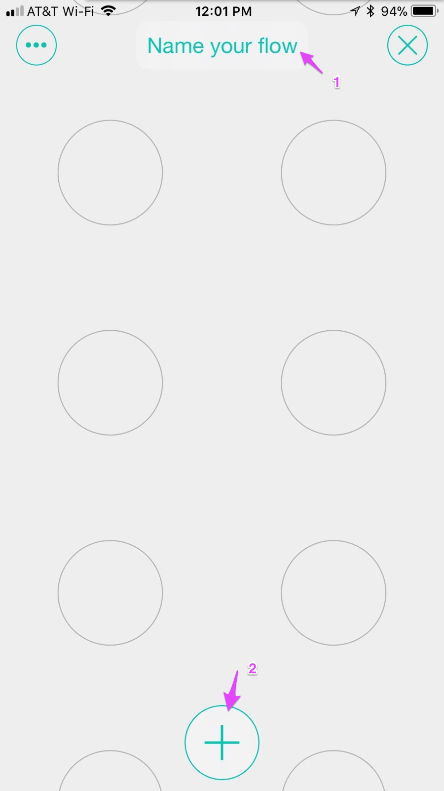

Click on Name your flow (1) to name your flow. I named this "Toggle led".

Then click the **+** at the bottom of the window (2) to add things.

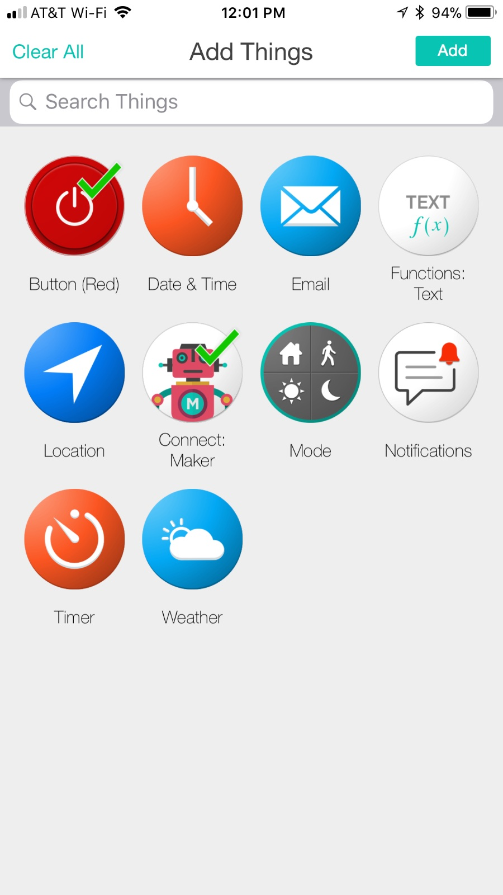

Click:

- Button (Red)
- Connect: Maker

You may need to search for Connect: Maker if it's not on your screen. Make sure both items have a green checkmark and then click **Add** in the upper right corner.

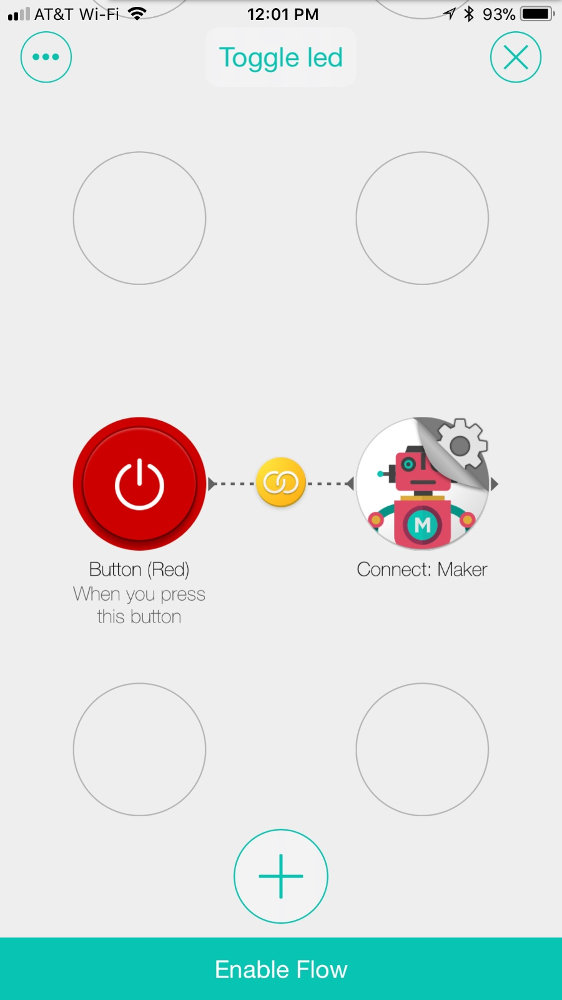

Drag the **Button (Red)** and **Connect: Maker** into adjacent circles. Then drag from **Button (Red)** on top of **Connect: Maker** to link the two.

Tap the **Connect: Maker** to configure it.

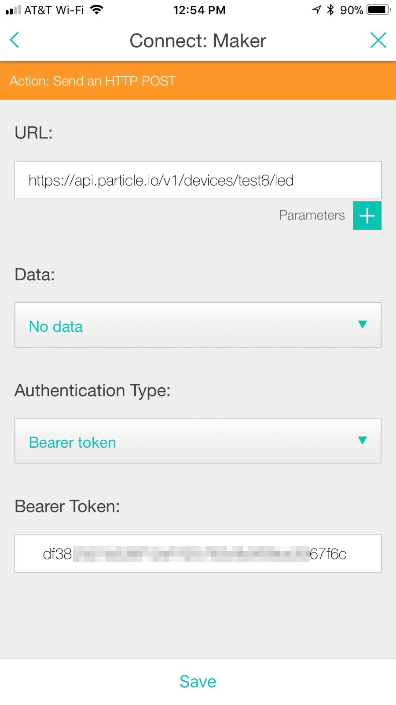

Enter the URL. Make sure you replace test8 with your device name.

```
https://api.particle.io/v1/devices/test8/led 
```

Set the **Data** to **No Data**.

Set the **Authentication Type** to **Bearer token**.

Paste in the access token you got earlier from the Settings page of https://build.particle.io.

**Save** the changes.

Enable the flow.

Now you should be able to go into **Things** and click the Red Button. Each time you click the button the blue D7 LED should turn on or off.


## Button to generate a notification

This example does the opposite, when you press a button on your Photon or Electron, it initiates a Stringify flow. In this example, it just sends a simple push notification.


### Notification - Create Flow

Create a new flow, name it, and click the **+** to add things.

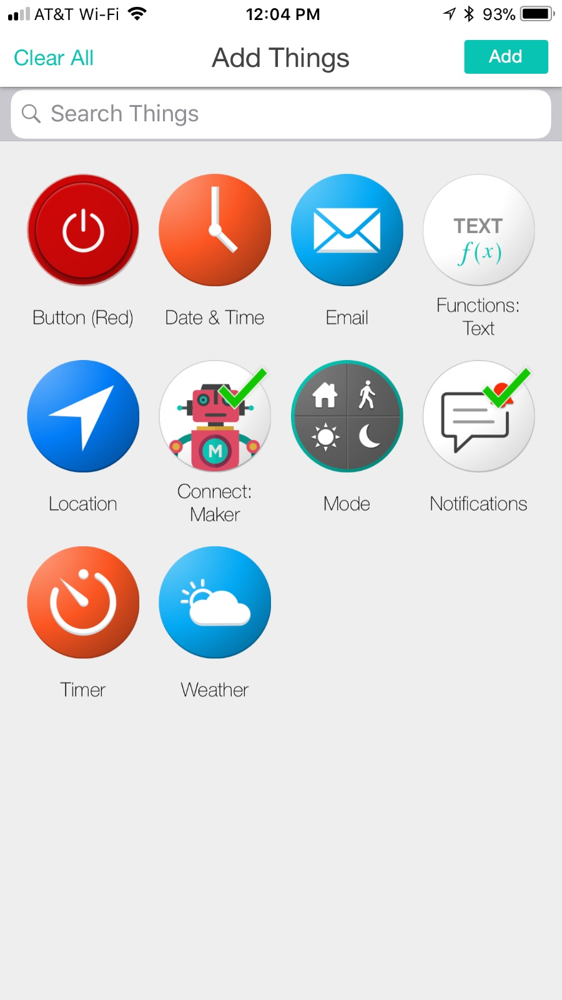

Add:

- **Connect: Maker**
- **Notifications**

Tap **Add** to add the things. 

Drag the two items into adjacent circles and connect them together.

Tap **Connect: Maker**. Copy the URL, you'll need it later.

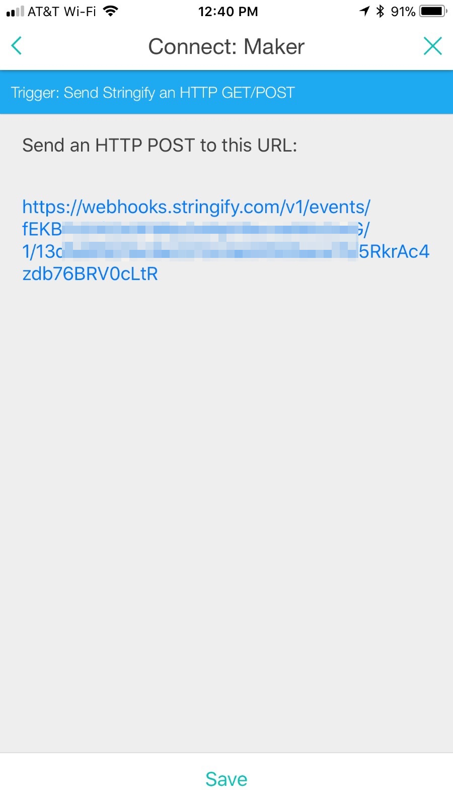

**Save** the settings.

Tap **Notifications** to configure your notification. I just put some text for testing purposes.

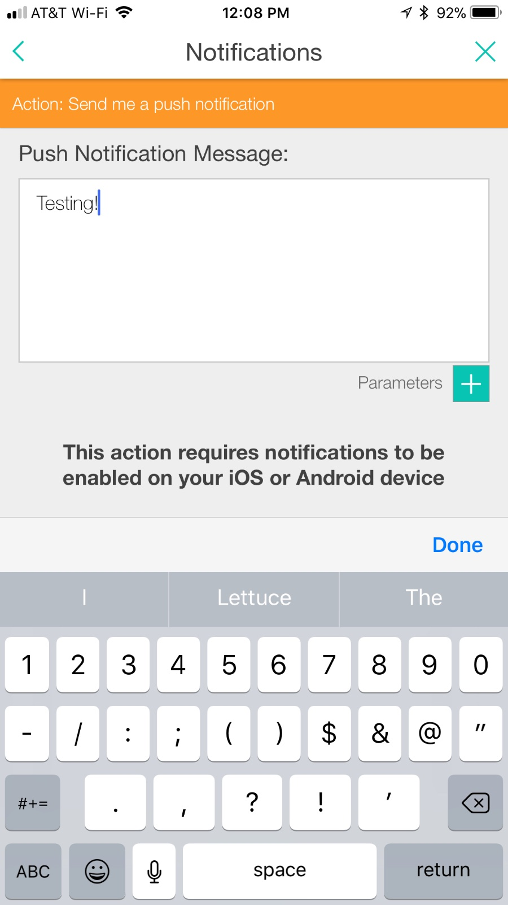

**Save** the settings.

Enable the flow.

### Create the webhook integration

Log into the [Particle console](https://console.particle.io) and click the Integrations icon.

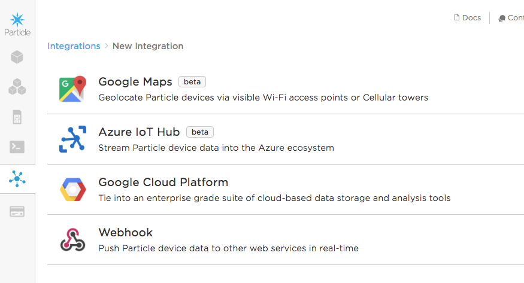

Create a new webhook.

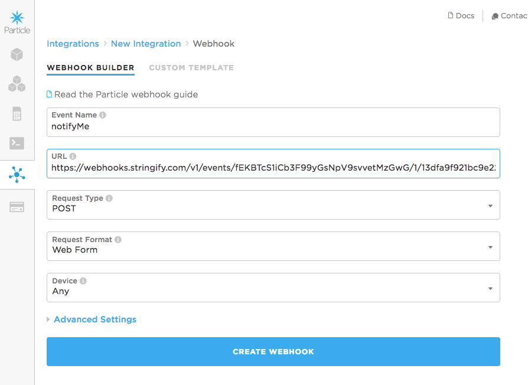

Set:

- Event Name to **notifyMe**
- URL to the Stringify URL you got from Connect: Maker

You can leave the other settings the default values.


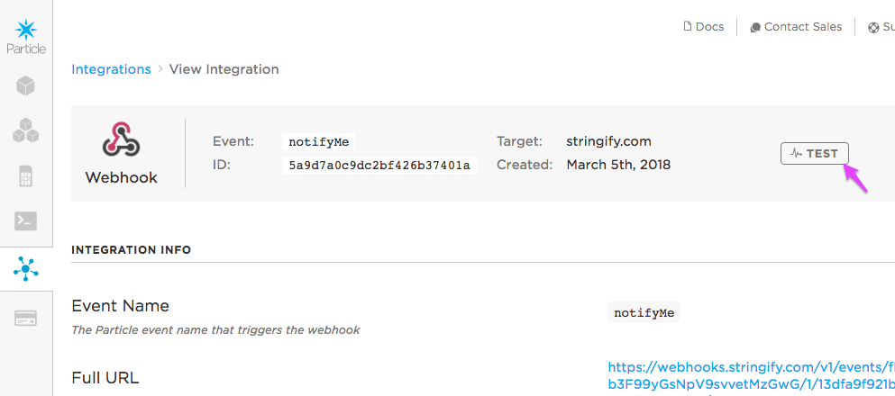

If you view this webhook, you can use the **Test** button which should generate a push notification on your phone.


### Notification - Firmware

Here's our device firmware. It uses the clickButton library to handle the debouncing of the switch.

```
#include "Particle.h"
#include "clickButton.h"

// Connect a momentary pushbutton switch between this pin and GND
const int BUTTON_PIN = D2;

ClickButton button(D2, LOW, true);

void setup() {
	Serial.begin(9600);
	pinMode(BUTTON_PIN, INPUT_PULLUP);

}

void loop() {
	button.Update();
	if (button.depressed) {
		Particle.publish("notifyMe", "", PRIVATE);
	}
}

```

You can use this code in Particle Build by using [this link](https://go.particle.io/shared_apps/5a9d84e5da1aeecbb10001f0).

Flash this code to your Photon or Electron.

Connect a momentary switch between D2 and GND.

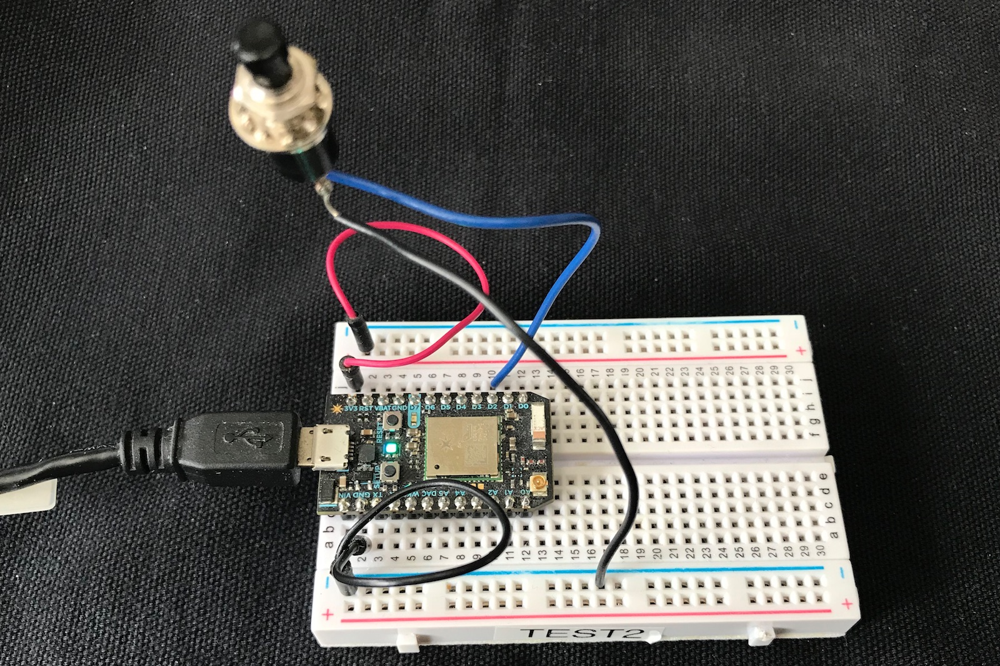

Now when you click the button, it should send a push notification to Stringify on your phone!

